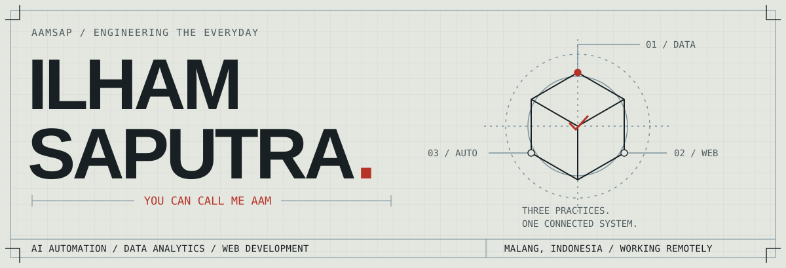

<picture>
  <source media="(prefers-color-scheme: dark) and (max-width: 600px)" srcset="assets/header-mobile-dark.svg">
  <source media="(max-width: 600px)" srcset="assets/header-mobile-light.svg">
  <source media="(prefers-color-scheme: dark)" srcset="assets/header-dark.svg">
  
</picture>

# Less busywork. More useful software.

I'm **Ilham Saputra**, usually called **Aam** — a data specialist and developer in **Malang, Indonesia**. I build AI workflows, dashboards, and web interfaces that help people spend less time moving information around and more time using it.

**Open to roles in AI automation, data analytics, and web development · Remote**

[Portfolio & case studies](https://aam.excellentchimp.com/) · [LinkedIn](https://www.linkedin.com/in/ilham-saputra-aam) · [Email me](mailto:ilhamsaputraferdinand@gmail.com)

## 01 / Work with a measurable outcome

- **75% less manual work per loan file; 2× loans processed.** An AI workflow for email intake, document checks, Drive filing, and missing-document follow-ups. [Loan processing →](https://aam.excellentchimp.com/#part-02)
- **Up to 15 hours saved per client, per week.** Reporting and automation work across HR, sales, health, operations, and property analysis. [Analytics & dashboards →](https://aam.excellentchimp.com/#part-08)
- **A human handoff when the request needs one.** An n8n support agent using client history and pricing, with escalation routing; a companion pipeline schedules social posts and logs results. [Workflow walkthrough →](https://aam.excellentchimp.com/#part-01)

## 02 / Open the hood

Three ways into my public code: an interface, a data product, and an automation tool.

### [Kanbaam ↗](https://github.com/aamsap/Kanbaam)

A local-first kanban board that runs by opening `index.html`. No account or server required. Includes keyboard task reordering, validated JSON import/export, and browser accessibility checks.

`JavaScript` `HTML / CSS` `Browser storage` `Playwright`

### [Chimp Chart ↗](https://github.com/aamsap/granite-chimp-charts)

A dashboard project that turns CSV and Excel uploads into AI-assisted KPI suggestions and visualizations, with PDF reporting. Connects my analytics work with interactive product development.

`React` `TypeScript` `Recharts` `Node.js`

### [Tableau Workbook Copier ↗](https://github.com/aamsap/bulk-copy-tableu)

A Python tool for copying workbooks between Tableau Server projects through the REST API. A focused example of automating repetitive reporting administration.

`Python` `Tableau` `REST APIs`

[Explore all repositories →](https://github.com/aamsap?tab=repositories)

## 03 / My working toolkit

| Practice | Tools I work with |
| :--- | :--- |
| **Automate the process** | Python, n8n, Google Apps Script, LLM APIs, Excel / VBA |
| **Make the data readable** | SQL, Power BI, Tableau, Looker Studio, Excel |
| **Build the interface** | JavaScript, TypeScript, React, HTML, CSS, Tailwind CSS |

<b>A little more background</b>

- **Data Specialist · Excellent Chimp · Jan 2025–present.** Client dashboards, AI workflow automation, and documentation.
- **Web Developer · Titik Koma Bintang · Jan 2022–Jan 2025.** Responsive interfaces, API integrations, dashboards, payment features, and database query optimization.
- **Digital Cadre · Ministry of Villages · Jan 2023–Dec 2024.** Helped communities use digital services and small businesses move online; delivered digital literacy training.

Teaching people to use technology is part of why I care about making it understandable.

[Full experience and education →](https://aam.excellentchimp.com/#sheet-05)

---

**Have a process that still runs by hand?** I'd like to help build what comes next.

[Let's talk about your team →](mailto:ilhamsaputraferdinand@gmail.com) · [Get to know my work →](https://aam.excellentchimp.com/)
